### 1. **Таблица `addresses`**

Хранит адреса пользователей для доставки.

**Функциональные зависимости:**
- `{id} -> {user_id, address}`
  
**Нормальные формы:**
- НФ1:
  - в таблице отсутствуют дублирующиеся строки
  - в каждой ячейке хранится атомарное значение
  - в столбце хранятся данные одного типа
  - отсутствуют массивы и списки в любом виде
- НФ2:
  - таблица находится в НФ1
  - таблица имеет ключ
  - все неключевые столбцы зависят от полного ключа
- НФ3:
  - таблица находится в НФ2
  - в таблицах отсутствует транзитивная зависимость
- НФБК: 
    - таблица находится в НФ3
    - все атрибуты зависят только от первичного ключа `id`.

**Ограничения:**
```sql
CREATE TABLE addresses (
  id UUID PRIMARY KEY,
  user_id UUID NOT NULL REFERENCES user_table(id) ON DELETE CASCADE,
  address TEXT NOT NULL,
  created_at TIMESTAMP NOT NULL DEFAULT NOW()
);
```

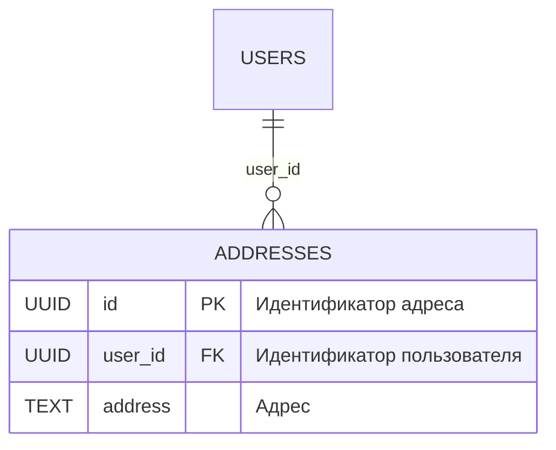

### 2. **Таблица `restaurant_categories`**

Содержит категории ресторанов (например, "итальянская кухня", "азиатская кухня").

**Функциональные зависимости:**
- `{id} -> {name}`

**Нормальные формы:**
- НФ1:
  - в таблице отсутствуют дублирующиеся строки
  - в каждой ячейке хранится атомарное значение
  - в столбце хранятся данные одного типа
  - отсутствуют массивы и списки в любом виде
- НФ2:
  - таблица находится в НФ1
  - таблица имеет ключ
  - все неключевые столбцы зависят от полного ключа
- НФ3:
  - таблица находится в НФ2
  - в таблицах отсутствует транзитивная зависимость
- НФБК: 
    - таблица находится в НФ3
    - все атрибуты зависят только от первичного ключа `id`.

**Ограничения:**
```sql
CREATE TABLE restaurant_category (
  id UUID PRIMARY KEY,
  name TEXT NOT NULL UNIQUE,
  created_at TIMESTAMP NOT NULL DEFAULT NOW()
);
```

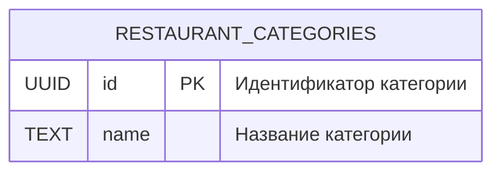

### 3. **Таблица `restaurant_category_relations`**

Связывает рестораны с их категориями (многие-ко-многим).

**Функциональные зависимости:**
- `{restaurant_id, category_id} -> {restaurant_id, category_id}`

**Нормальные формы:**
- НФ1:
  - в таблице отсутствуют дублирующиеся строки
  - в каждой ячейке хранится атомарное значение
  - в столбце хранятся данные одного типа
  - отсутствуют массивы и списки в любом виде
- НФ2:
  - таблица находится в НФ1
  - таблица имеет ключ
  - все неключевые столбцы зависят от полного ключа
- НФ3:
  - таблица находится в НФ2
  - в таблицах отсутствует транзитивная зависимость
- НФБК: 
    - таблица находится в НФ3
    - все атрибуты зависят только от первичного ключа `id`.

**Ограничения:**
```sql
CREATE TABLE restaurant_category_relation (
  restaurant_id UUID NOT NULL REFERENCES restaurant(id) ON DELETE CASCADE,
  category_id UUID NOT NULL REFERENCES restaurant_category(id) ON DELETE CASCADE,
  PRIMARY KEY (restaurant_id, category_id)
);
```

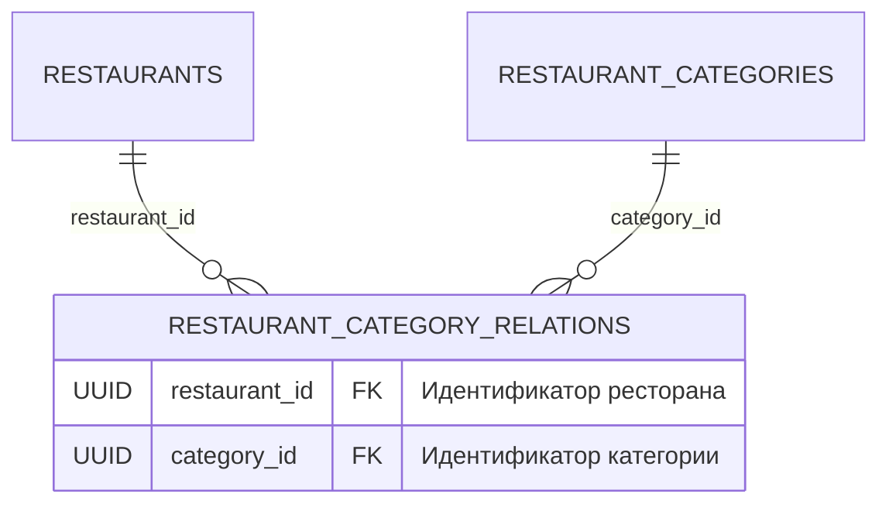

### 4. **Таблица `product_categories`**

Содержит категории продуктов (например, "суши", "пицца").

**Функциональные зависимости:**
- `{id} -> {name}`

**Нормальные формы:**
- НФ1:
  - в таблице отсутствуют дублирующиеся строки
  - в каждой ячейке хранится атомарное значение
  - в столбце хранятся данные одного типа
  - отсутствуют массивы и списки в любом виде
- НФ2:
  - таблица находится в НФ1
  - таблица имеет ключ
  - все неключевые столбцы зависят от полного ключа
- НФ3:
  - таблица находится в НФ2
  - в таблицах отсутствует транзитивная зависимость
- НФБК: 
    - таблица находится в НФ3
    - все атрибуты зависят только от первичного ключа `id`.

**Ограничения:**
```sql
CREATE TABLE product_category (
  id UUID PRIMARY KEY,
  name TEXT NOT NULL UNIQUE,
  created_at TIMESTAMP NOT NULL DEFAULT NOW()
);
```

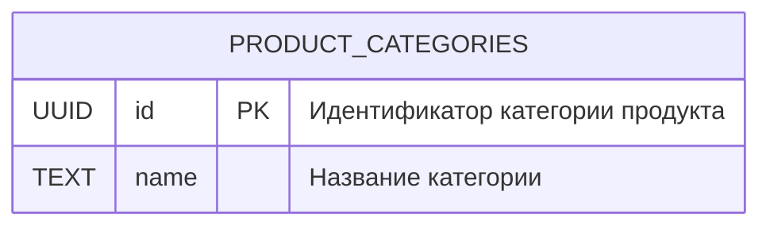

### 5. **Таблица `product_category_relations`**

Связывает продукты с их категориями (многие-ко-многим).

**Функциональные зависимости:**
- `{product_id, category_id} -> {product_id, category_id}`

**Нормальные формы:**
- НФ1:
  - в таблице отсутствуют дублирующиеся строки
  - в каждой ячейке хранится атомарное значение
  - в столбце хранятся данные одного типа
  - отсутствуют массивы и списки в любом виде
- НФ2:
  - таблица находится в НФ1
  - таблица имеет ключ
  - все неключевые столбцы зависят от полного ключа
- НФ3:
  - таблица находится в НФ2
  - в таблицах отсутствует транзитивная зависимость
- НФБК: 
    - таблица находится в НФ3
    - все атрибуты зависят только от первичного ключа `id`.

**Ограничения:**
```sql
CREATE TABLE product_category_relation (
  product_id UUID NOT NULL REFERENCES product(id) ON DELETE CASCADE,
  category_id UUID NOT NULL REFERENCES product_category(id) ON DELETE CASCADE,
  PRIMARY KEY (product_id, category_id)
);
```

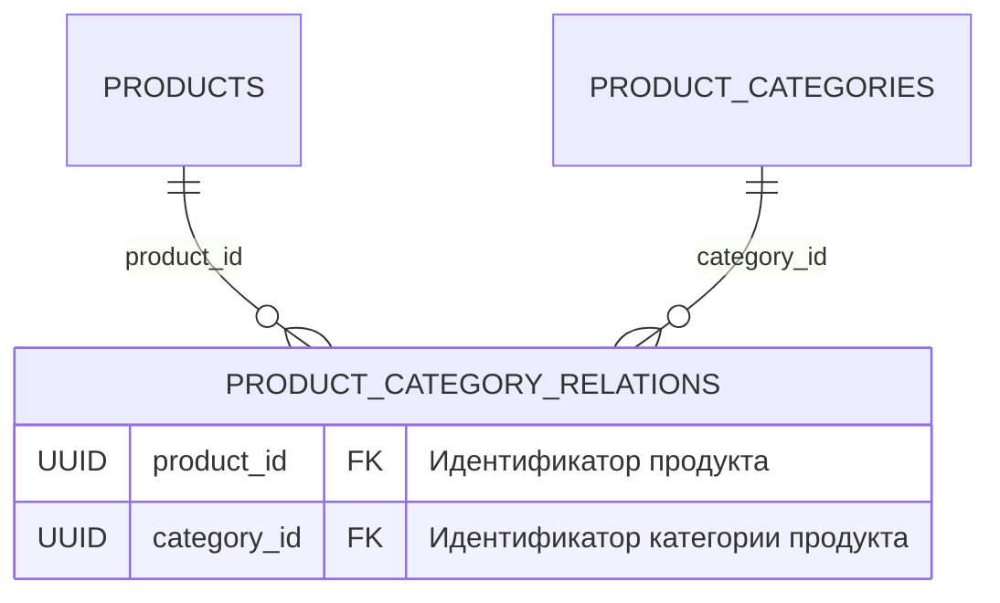

### 6. **Таблица `order_table`**

Хранит информацию о заказах пользователей.

**Функциональные зависимости:**
- `{id} -> {user_id, restaurant_id, address_id, status, total_price, created_at, updated_at}`

**Нормальные формы:**
- НФ1:
  - в таблице отсутствуют дублирующиеся строки
  - в каждой ячейке хранится атомарное значение
  - в столбце хранятся данные одного типа
  - отсутствуют массивы и списки в любом виде
- НФ2:
  - таблица находится в НФ1
  - таблица имеет ключ
  - все неключевые столбцы зависят от полного ключа
- НФ3:
  - таблица находится в НФ2
  - в таблицах отсутствует транзитивная зависимость
- НФБК: 
    - таблица находится в НФ3
    - все атрибуты зависят только от первичного ключа `id`.

**Ограничения:**
```sql
CREATE TABLE order_table (
  id UUID PRIMARY KEY,
  user_id UUID NOT NULL REFERENCES user_table(id),
  restaurant_id UUID NOT NULL REFERENCES restaurant(id),
  address_id UUID NOT NULL REFERENCES address(id),
  status TEXT NOT NULL CHECK (status IN ('new', 'preparing', 'delivering', 'delivered', 'canceled')),
  total_price NUMERIC(2) NOT NULL CHECK (total_price > 0),
  created_at TIMESTAMP NOT NULL DEFAULT NOW(),
  updated_at TIMESTAMP NOT NULL DEFAULT NOW()
);
```

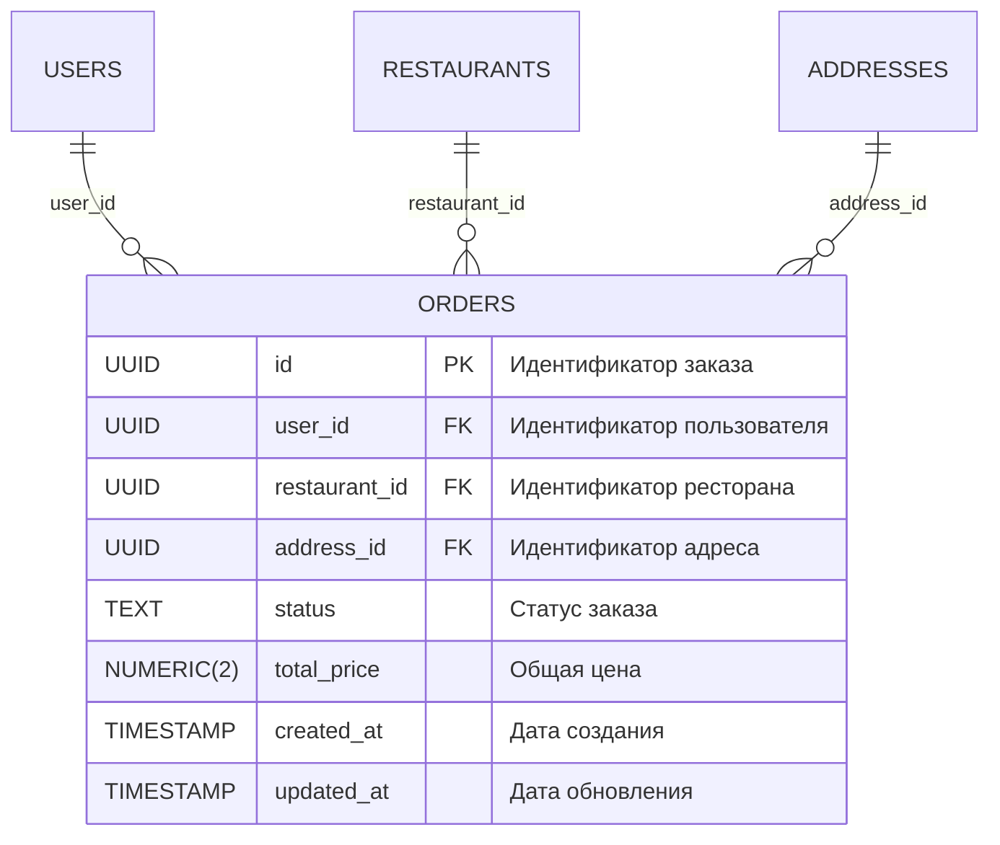

### 7. **Таблица `order_items`**

Содержит позиции в заказах.

**Функциональные зависимости:**
- `{order_id, product_id} -> {order_id, product_id, quantity, price_at_time}`

**Нормальные формы:**
- НФ1:
  - в таблице отсутствуют дублирующиеся строки
  - в каждой ячейке хранится атомарное значение
  - в столбце хранятся данные одного типа
  - отсутствуют массивы и списки в любом виде
- НФ2:
  - таблица находится в НФ1
  - таблица имеет ключ
  - все неключевые столбцы зависят от полного ключа
- НФ3:
  - таблица находится в НФ2
  - в таблицах отсутствует транзитивная зависимость
- НФБК: 
    - таблица находится в НФ3
    - все атрибуты зависят только от первичного ключа `id`.

**Ограничения:**
```sql
CREATE TABLE order_item (
  order_id UUID NOT NULL REFERENCES order_table(id) ON DELETE CASCADE,
  product_id UUID NOT NULL REFERENCES product(id),
  quantity INT NOT NULL CHECK (quantity > 0),
  price_at_time NUMERIC(2) NOT NULL CHECK (price_at_time > 0),
  PRIMARY KEY (order_id, product_id)
);
```

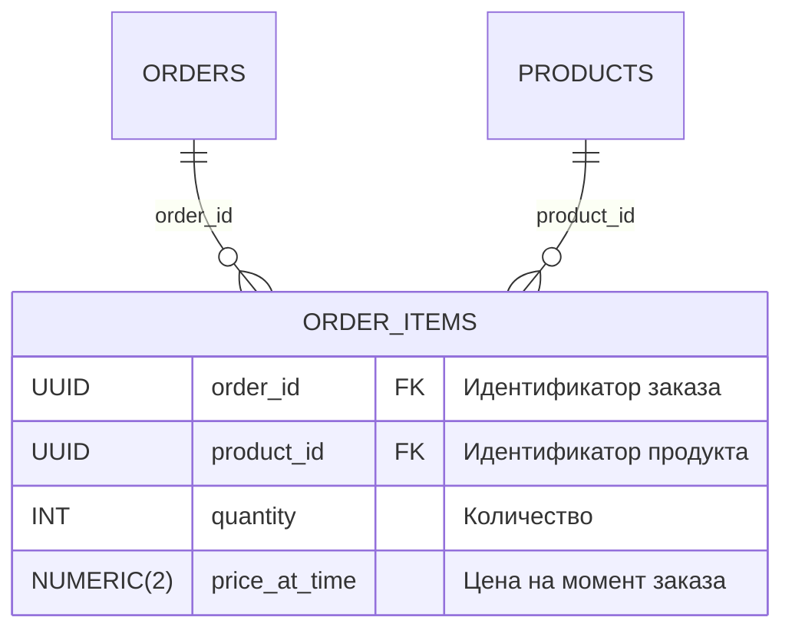

### 8. **Таблица `reviews`**

Хранит отзывы пользователей о ресторанах.

**Функциональные зависимости:**
- `{id} -> {user_id, restaurant_id, rating, comment, created_at}`

**Нормальные формы:**
- НФ1:
  - в таблице отсутствуют дублирующиеся строки
  - в каждой ячейке хранится атомарное значение
  - в столбце хранятся данные одного типа
  - отсутствуют массивы и списки в любом виде
- НФ2:
  - таблица находится в НФ1
  - таблица имеет ключ
  - все неключевые столбцы зависят от полного ключа
- НФ3:
  - таблица находится в НФ2
  - в таблицах отсутствует транзитивная зависимость
- НФБК: 
    - таблица находится в НФ3
    - все атрибуты зависят только от первичного ключа `id`.

**Ограничения:**
```sql
CREATE TABLE review (
  id UUID PRIMARY KEY,
  user_id UUID NOT NULL REFERENCES user_table(id),
  restaurant_id UUID NOT NULL REFERENCES restaurant(id),
  rating INT NOT NULL CHECK (rating BETWEEN 1 AND 5),
  comment TEXT,
  created_at TIMESTAMP NOT NULL DEFAULT NOW(),
  UNIQUE (user_id, restaurant_id)
);
```

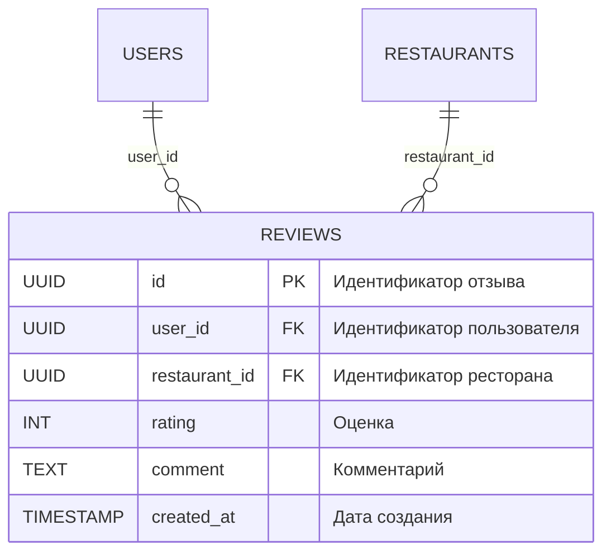

### 9. **Таблица `promo_codes`**

Содержит промокоды для скидок.

**Функциональные зависимости:**
- `{id} -> {code, discount_percent, expiration_date}`

**Нормальные формы:**
- НФ1:
  - в таблице отсутствуют дублирующиеся строки
  - в каждой ячейке хранится атомарное значение
  - в столбце хранятся данные одного типа
  - отсутствуют массивы и списки в любом виде
- НФ2:
  - таблица находится в НФ1
  - таблица имеет ключ
  - все неключевые столбцы зависят от полного ключа
- НФ3:
  - таблица находится в НФ2
  - в таблицах отсутствует транзитивная зависимость
- НФБК: 
    - таблица находится в НФ3
    - все атрибуты зависят только от первичного ключа `id`.

**Ограничения:**
```sql
CREATE TABLE promo_code (
  id UUID PRIMARY KEY,
  code TEXT NOT NULL UNIQUE,
  discount_percent INT NOT NULL CHECK (discount_percent BETWEEN 1 AND 100),
  expiration_date TIMESTAMP NOT NULL,
  created_at TIMESTAMP NOT NULL DEFAULT NOW()
);
```

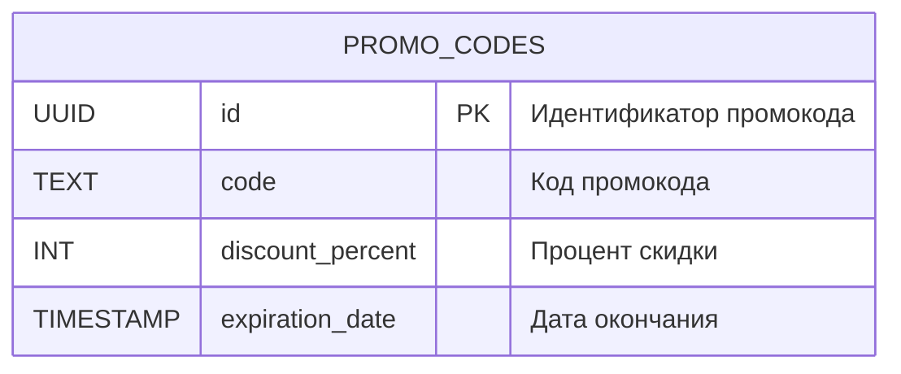

### 10. **Таблица `recommendations`**

Хранит рекомендации блюд для пользователей.

**Функциональные зависимости:**
- `{id} -> {user_id, menu_item_id, created_at}`

**Нормальные формы:**
- НФ1:
  - в таблице отсутствуют дублирующиеся строки
  - в каждой ячейке хранится атомарное значение
  - в столбце хранятся данные одного типа
  - отсутствуют массивы и списки в любом виде
- НФ2:
  - таблица находится в НФ1
  - таблица имеет ключ
  - все неключевые столбцы зависят от полного ключа
- НФ3:
  - таблица находится в НФ2
  - в таблицах отсутствует транзитивная зависимость
- НФБК: 
    - таблица находится в НФ3
    - все атрибуты зависят только от первичного ключа `id`.

**Ограничения:**
```sql
CREATE TABLE recommendation (
  id UUID PRIMARY KEY,
  user_id UUID NOT NULL REFERENCES user_table(id) ON DELETE CASCADE,
  product_id UUID NOT NULL REFERENCES product(id) ON DELETE CASCADE,
  created_at TIMESTAMP NOT NULL DEFAULT NOW()
);
```

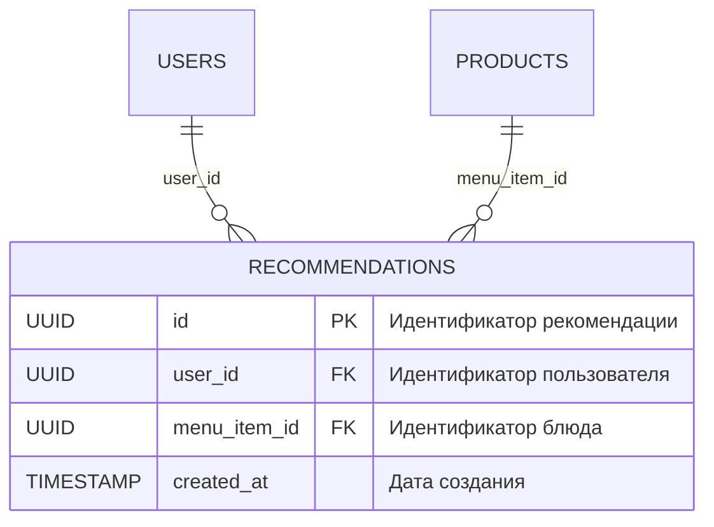

Продолжаем анализ нормальных форм для оставшихся таблиц.

### 11. **Таблица `user_table`** 

Содержит данные пользователей.

**Функциональные зависимости:**
- `{id} -> {login, email, first_name, last_name, passwordhash, description, user_pic}`

**Нормальные формы:**
- НФ1:
  - в таблице отсутствуют дублирующиеся строки
  - в каждой ячейке хранится атомарное значение
  - в столбце хранятся данные одного типа
  - отсутствуют массивы и списки в любом виде
- НФ2:
  - таблица находится в НФ1
  - таблица имеет ключ
  - все неключевые столбцы зависят от полного ключа
- НФ3:
  - таблица находится в НФ2
  - в таблицах отсутствует транзитивная зависимость
- НФБК: 
    - таблица находится в НФ3
    - все атрибуты зависят только от первичного ключа `id`.

**Ограничения:**
```sql
CREATE TABLE user_table (
  id UUID PRIMARY KEY,
  username TEXT NOT NULL UNIQUE,
  email TEXT NOT NULL UNIQUE,
  first_name TEXT NOT NULL,
  last_name TEXT NOT NULL,
  password_hash TEXT NOT NULL,
  description TEXT,
  user_pic TEXT,
  created_at TIMESTAMP NOT NULL DEFAULT NOW(),
  updated_at TIMESTAMP NOT NULL DEFAULT NOW()
);
```

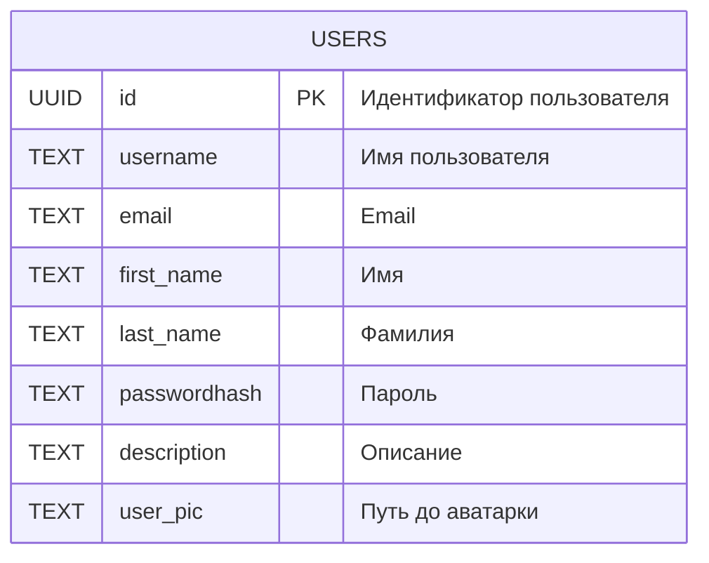

### 12. **Таблица `restaurants`** 

Хранит данные ресторанов.

**Функциональные зависимости:**
- `{id} -> {name, banner_url, address, rating, rating_count, working_mode_from, working_mode_to, delivery_time_from, delivery_time_to}`

**Нормальные формы:**
- НФ1:
  - в таблице отсутствуют дублирующиеся строки
  - в каждой ячейке хранится атомарное значение
  - в столбце хранятся данные одного типа
  - отсутствуют массивы и списки в любом виде
- НФ2:
  - таблица находится в НФ1
  - таблица имеет ключ
  - все неключевые столбцы зависят от полного ключа
- НФ3:
  - таблица находится в НФ2
  - в таблицах отсутствует транзитивная зависимость
- НФБК: 
    - таблица находится в НФ3
    - все атрибуты зависят только от первичного ключа `id`.

**Ограничения:**
```sql
CREATE TABLE restaurant (
  id UUID PRIMARY KEY,
  name TEXT NOT NULL,
  banner_url TEXT,
  address TEXT NOT NULL,
  rating FLOAT DEFAULT 0 CHECK (rating BETWEEN 0 AND 5),
  rating_count INT DEFAULT 0 CHECK (rating_count >= 0),
  working_mode_from INT NOT NULL CHECK (working_mode_from BETWEEN 0 AND 23),
  working_mode_to INT NOT NULL CHECK (working_mode_to BETWEEN 0 AND 23),
  delivery_time_from INT NOT NULL CHECK (delivery_time_from BETWEEN 0 AND 23),
  delivery_time_to INT NOT NULL CHECK (delivery_time_to BETWEEN 0 AND 23),
  created_at TIMESTAMP NOT NULL DEFAULT NOW(),
  updated_at TIMESTAMP NOT NULL DEFAULT NOW(),
  CHECK (working_mode_from < working_mode_to),
  CHECK (delivery_time_from < delivery_time_to)
);
```

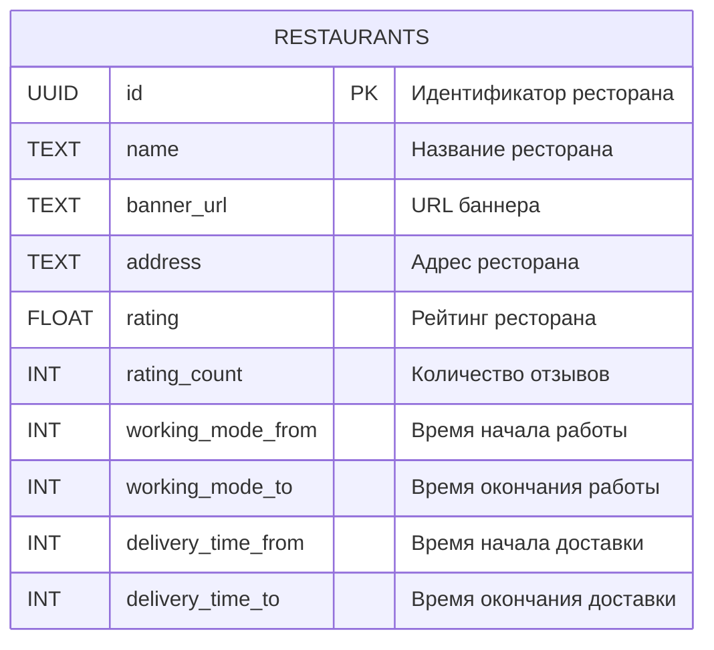

### 13. **Таблица `products`** 

Содержит данные о продуктах/блюдах.

**Функциональные зависимости:**
- `{id} -> {name, price, image_url, weight, category_id}`

**Нормальные формы:**
- НФ1:
  - в таблице отсутствуют дублирующиеся строки
  - в каждой ячейке хранится атомарное значение
  - в столбце хранятся данные одного типа
  - отсутствуют массивы и списки в любом виде
- НФ2:
  - таблица находится в НФ1
  - таблица имеет ключ
  - все неключевые столбцы зависят от полного ключа
- НФ3:
  - таблица находится в НФ2
  - в таблицах отсутствует транзитивная зависимость
- НФБК: 
    - таблица находится в НФ3
    - все атрибуты зависят только от первичного ключа `id`.

**Ограничения:**
```sql
CREATE TABLE product (
  id UUID PRIMARY KEY,
  name TEXT NOT NULL,
  price NUMERIC(2) NOT NULL CHECK (price > 0),
  image_url TEXT,
  weight INT CHECK (weight > 0),
  category_id UUID NOT NULL REFERENCES product_category(id),
  restaurant_id UUID NOT NULL REFERENCES restaurant(id) ON DELETE CASCADE,
  created_at TIMESTAMP NOT NULL DEFAULT NOW(),
  updated_at TIMESTAMP NOT NULL DEFAULT NOW()
);
```

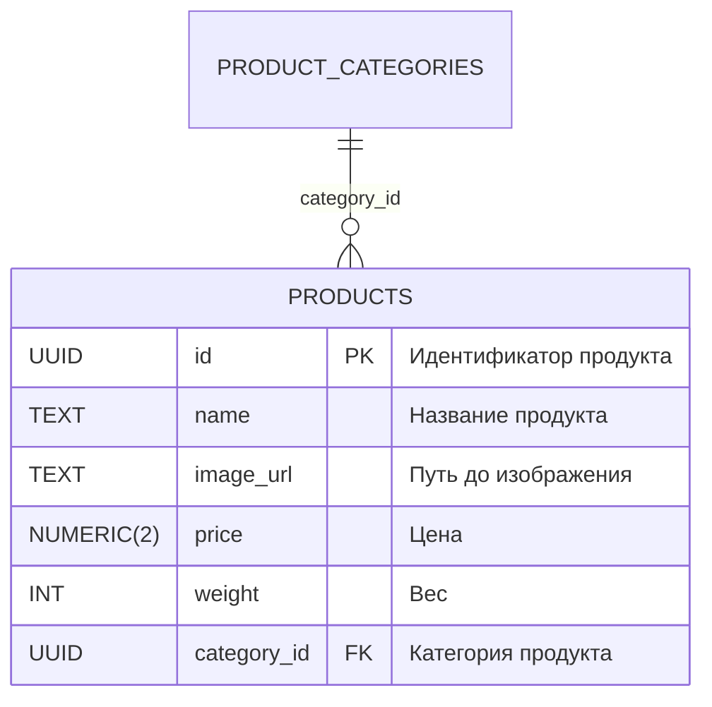